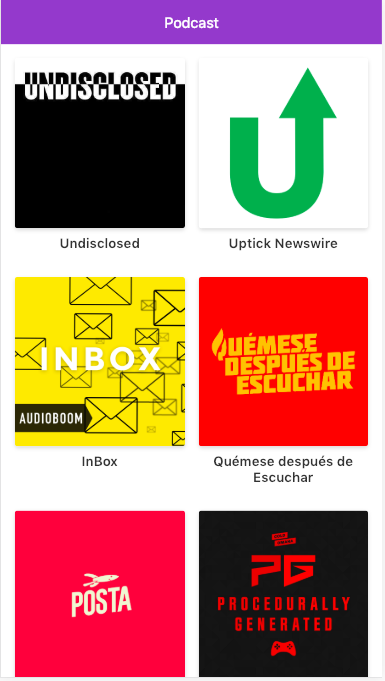

# App de podcast con next.js

app de podcast integrada con la api de audioboom para practira next.js

## Como funciona? 

Requiere Node.js

* `npm install` para instalar las dependencias
* `npm run dev` para el entorno de desarrollo
* `npm run build && npm start` para el entorno de produccion

## Licencia

MIT

